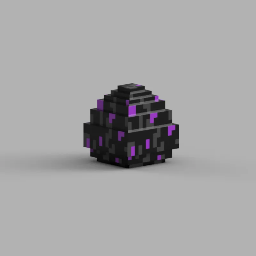

# DragonSlimmer Gear Pack

A Minecraft Bedrock behavior pack for practicing Ender Dragon fights. One command drops a full netherite loadout into exact inventory slots, already enchanted and already equipped, no holding items, no manual enchanting 

  
   
  

  <a href="https://www.printables.com/model/1335964-ender-dragon-egg-assemblehuevo-ender-dragon-minecr/related">pack_icon</a>

## Install

1. Download [`DragonSlimmerGearPack.mcpack`](https://github.com/FivIt/DragonSlimmingGearPack/releases/download/bedrock/DragonSlimmerGearPack.mcpack)

2. Open it from your device's file manager so Minecraft imports it.
3. In your world settings, add **DragonSlimmer Gear Pack** under Global Resources / Behavior Packs.
4. Turn **Cheats** on for that world. Required, both the command block and the script depend on it.

## To Use
- Chat `/scriptevent dragon:gear`

or Place one command block:

- Type: Impulse
- Needs Redstone: ON
- Command: `/scriptevent dragon:gear`
- A button or lever on top

  Press it once. Armor and offhand totem equip automatically, everything else lands in the exact slot listed below.

  If the script module fails to load (you'll see a "missing dependency" error), the pack falls back to a manual 9-button setup in "functions/", one button per item, hold it and press the matching button to enchant. Slower, but doesn't depend on the scripting API.

## Loadout

**Equipped**
| Slot | Item | Enchants |
|---|---|---|
| Head | Netherite Helmet | Protection IV, Unbreaking III, Mending I, Respiration III, Aqua Affinity I |
| Chest | Netherite Chestplate | Protection IV, Unbreaking III, Mending I |
| Legs | Netherite Leggings | Protection IV, Unbreaking III, Mending I, Swift Sneak III |
| Feet | Netherite Boots | Protection IV, Unbreaking III, Mending I, Feather Falling IV, Depth Strider III |
| Offhand | Totem of Undying | — |

**Row 1 (hotbar)**: Netherite Sword (Sharpness V, Unbreaking III, Mending I, Looting III, Fire Aspect II, Knockback II) · Spear — Lunge III build (no Mending, they conflict) · Spear — Mending build · Bow (Power V, Unbreaking III, Flame I, Infinity I) · Golden Carrot ×64 · Golden Apple ×64 · Ender Pearl ×16 · Totem (backup) · Snow ×64

**Row 2**: Ender Pearl ×16 ×2 · Snow ×64 ×3 · Totem (backup) ×3 · Netherite Shovel

**Row 3**: Splash Potion of Strength (Extended) ×4 · Arrow ×1 (plain — see note below) · Splash Potion of Instant Health II ×3 · Carved Pumpkin

**Row 4**: Ender Chest · Splash Potion of Swiftness (Extended) ×4 · Splash Potion of Instant Health II ×3

## Notes

- Snow blocks (not layers) are for pillaring up to crystals fast, not explosion protection, with shovel you can turn them into snow balls you can only hold 16 stack of it so snow block is used to barrage the towers and destroy the crystals.
- The Carved Pumpkin isn't equipped by default since it'd replace the enchanted helmet. Swap it on manually if endermen are piling up.
- Both spears exist because Lunge and Mending can't go on the same item.
- The Bow has infinity.

  <strong>Author's note</strong>: <em>The code is free to use, it's for personal use. I didnt put a hand coding its just Claude's work and I just put ideas and words for him, so feel free to use this and edit any thing you want.</em>

  <a href="https://claude.ai/">Claude</a>
